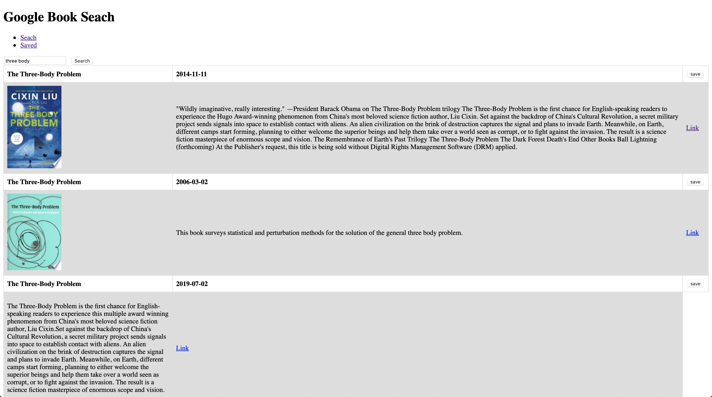
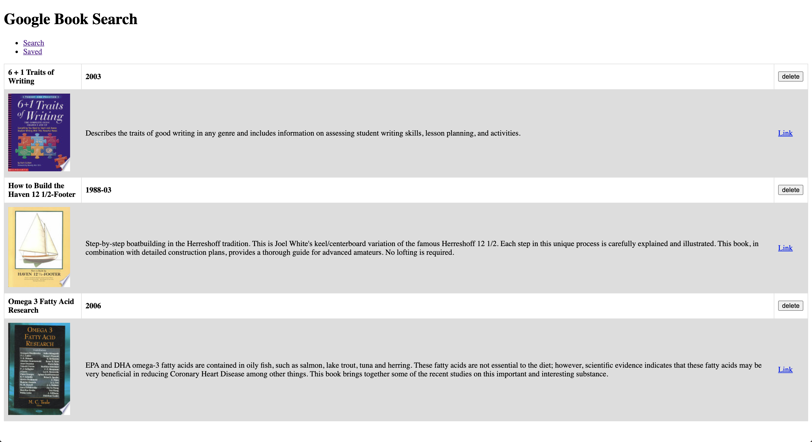

# Google-Books-Search

- [About](#about)
- [Link](#link)
- [Tech Used](#Tech-Used)
- [Screenshot](#screenshot)
- [License](#license)

## About
This is a simple MERN stack application that will call google books API to return user search results. User can save their search results to MySQL database and view them in saved page. Inside of saved page user will have access to all the saved books on the database and be able delete them. 

## Link
[Google Books Search](https://frozen-anchorage-90956.herokuapp.com)

## Tech Used
React, NodeJs, Sequelize, Google Books API, Express

## Screenshot

## License

[MIT License](LICENSE)